# Architecture Diagram - Data Engineering Portfolio
## Data Engineer @ ATS Vietnam

---

## 1. High-Level System Architecture

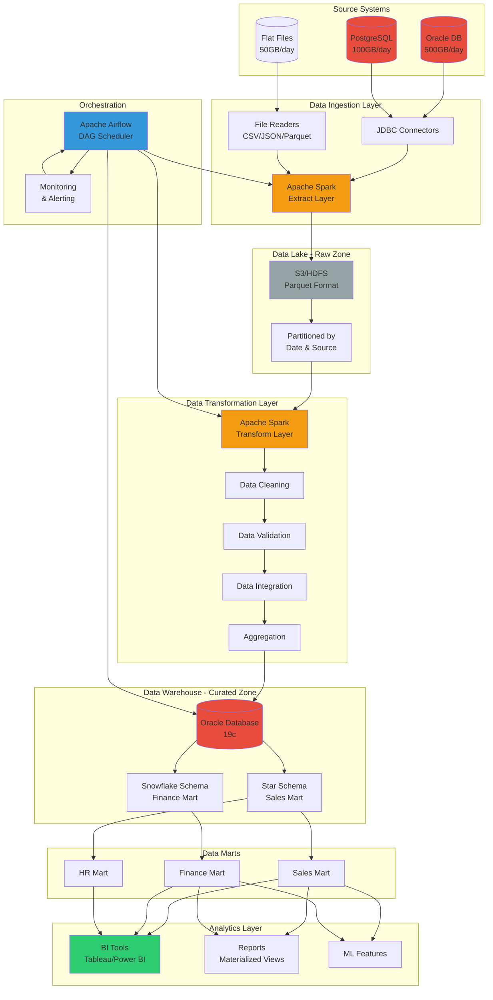

---

## 2. Data Pipeline Flow Diagram

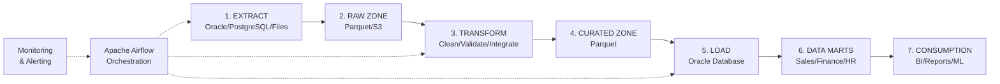

---

## 3. Star Schema - Sales Data Mart

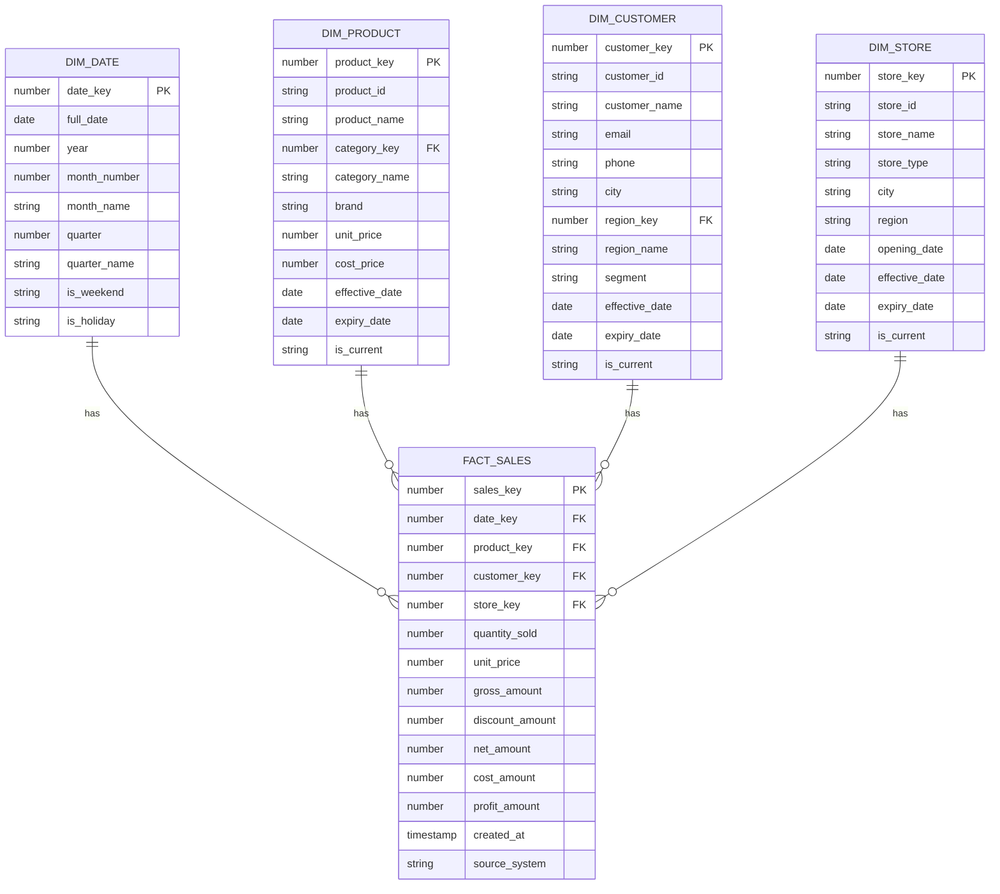

---

## 4. Snowflake Schema - Finance Data Mart

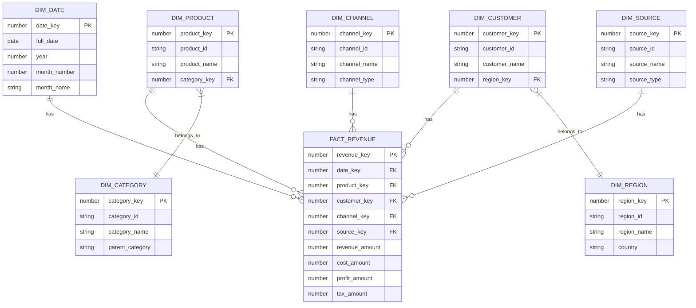

---

## 5. Airflow DAG Flow

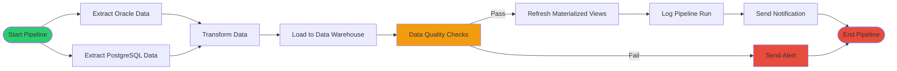

---

## 6. Technology Stack Components

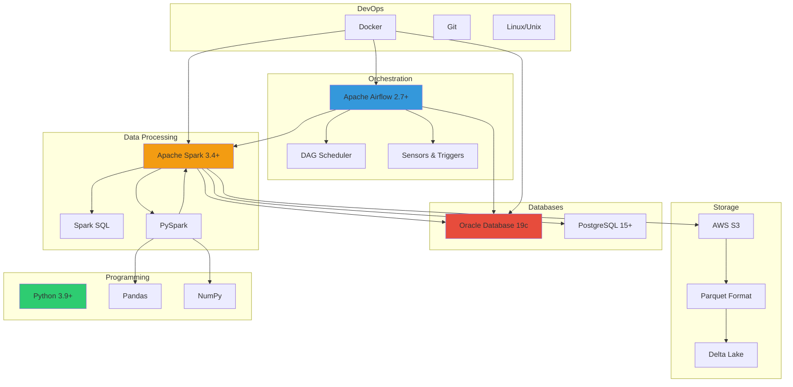

---

## 7. Data Flow Details

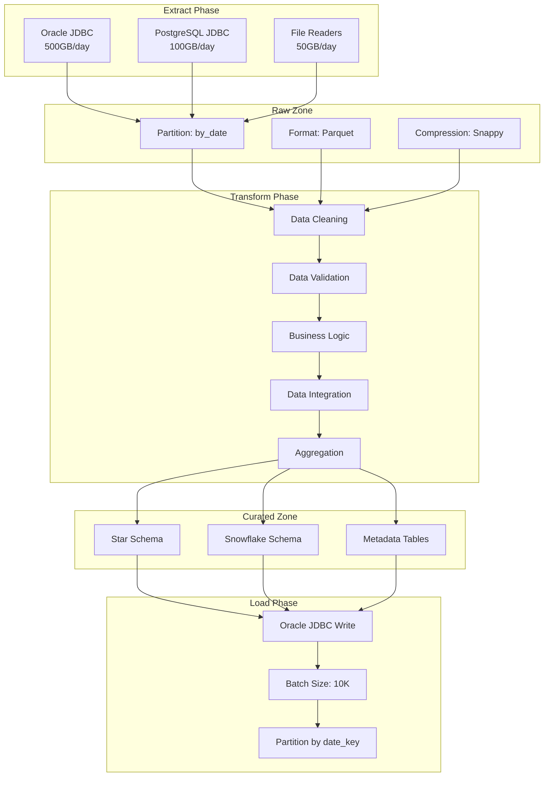

---

## 8. Component Interaction Diagram

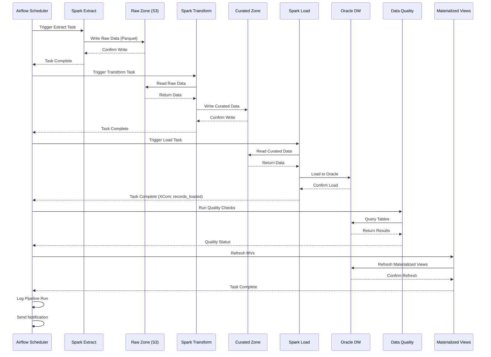

---

## 9. Database Architecture

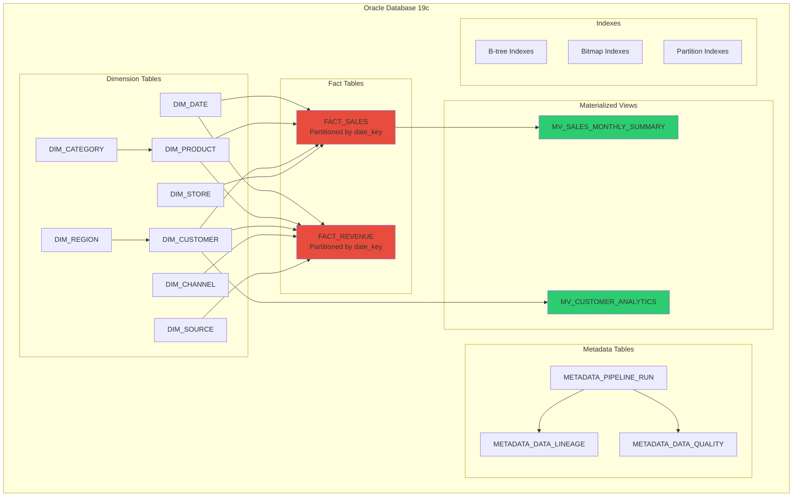

---

## 10. Performance Optimization Strategies

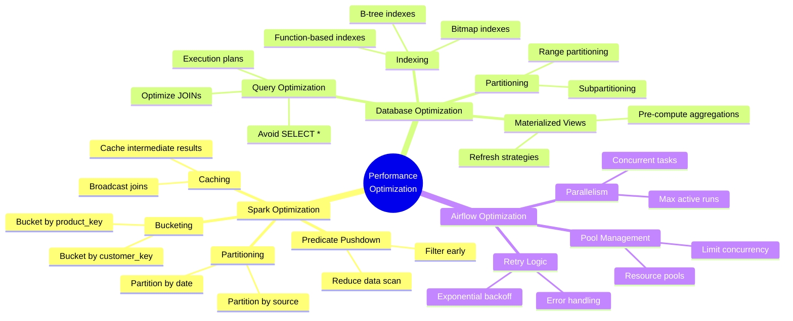

---

## 11. Data Quality Framework

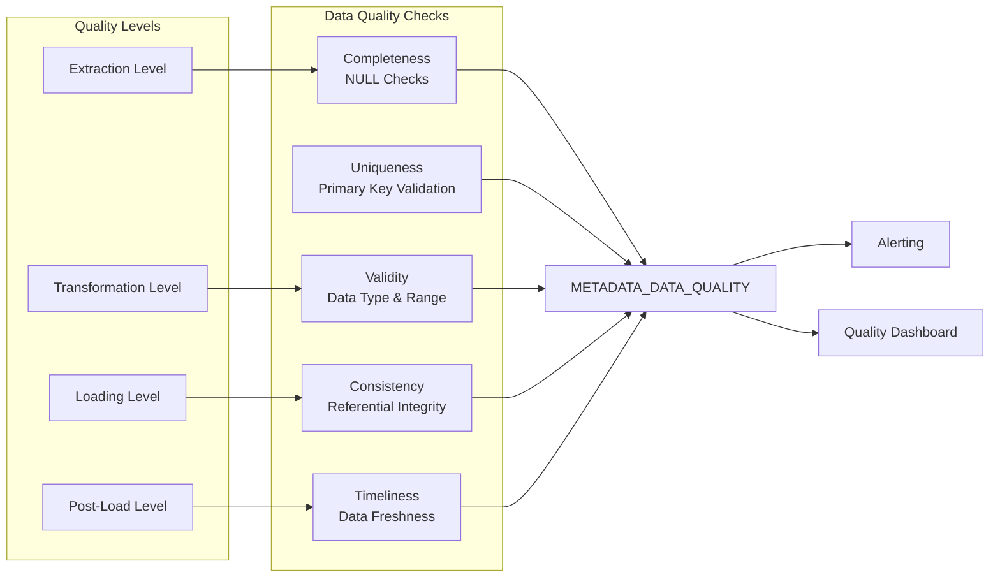

---

## 12. Deployment Architecture

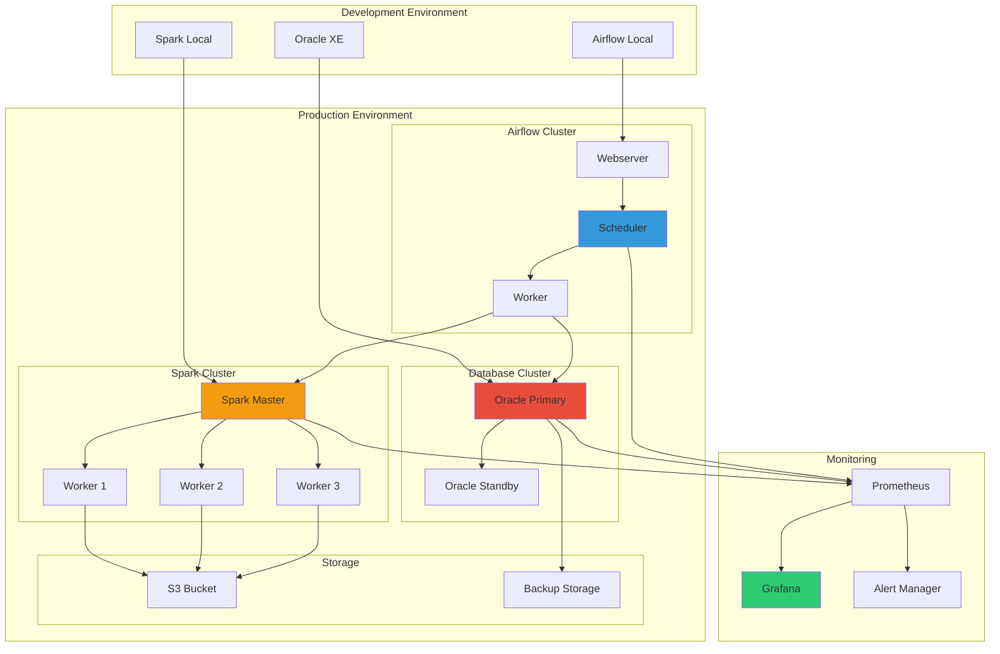

---

## 13. Security & Compliance

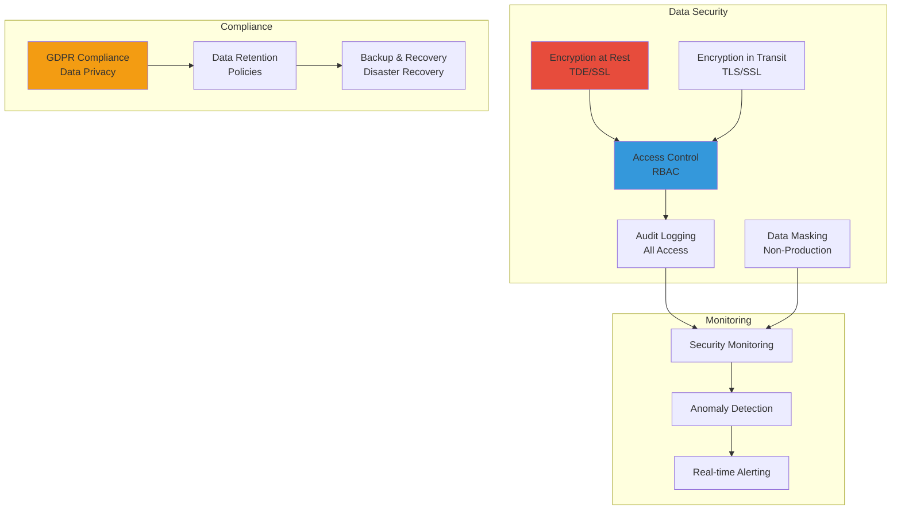

---

## 14. Scalability & Future Enhancements

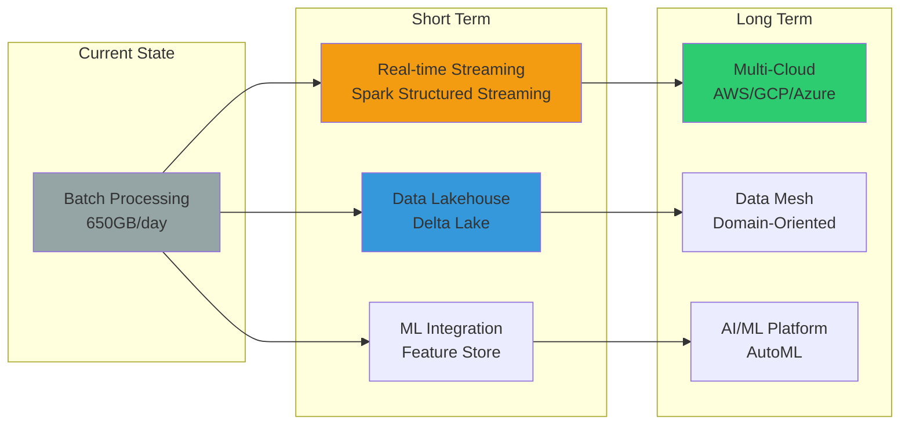

---

## Summary

This architecture diagram illustrates a complete data engineering solution that includes:

✅ **Scalable Architecture:** Handle 650GB+ data/day with Spark  
✅ **Robust ETL Pipeline:** Extract, Transform, Load with validation  
✅ **Data Warehouse:** Star Schema & Snowflake Schema on Oracle  
✅ **Orchestration:** Airflow DAGs for automation  
✅ **Monitoring:** Data quality checks and alerting  
✅ **Performance:** Optimized with partitioning, indexing, and materialized views  
✅ **Security:** Encryption, access control, and audit logging  
✅ **Scalability:** Horizontal scaling with Spark cluster  

This demonstrates the skills required for the Data Engineer position at ATS Vietnam, including:
- Apache Spark + SQL + Database expertise
- Data modeling and database design
- ETL pipeline development
- Performance optimization
- Production-grade system design